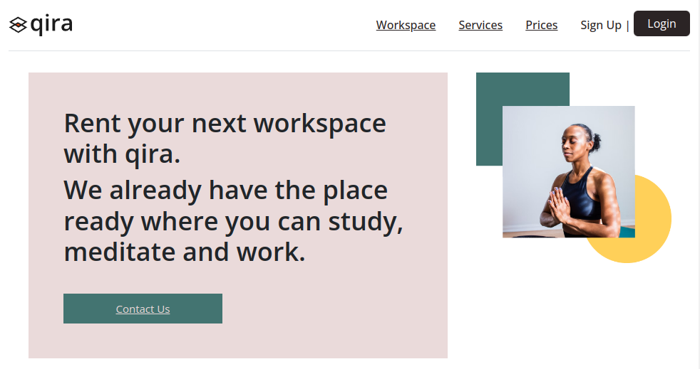

# Antonio Rodriguez 

  <h1>Landing page qira</h1>
  <strong>Documentación del proyecto y marcos de trabajo que se utilizan</strong> 
  <strong>Proyecto :</strong>

 

## Landing page 

Es una recopilación de prácticas y proyectos:

 

### 🏗 Equipo: 

- [@T0ny-dev](https://github.com/T0ny-dev)

### 👨‍💻 Listados de marcos de trabajo

* HTML
* CSS
* Bootstrap v5.0

### 💻 Listados comandos 

* `git clone `    Clonara el repositorio

### 💻 Deploy GitHub Pages
- [000webhost](https://qira-workspace.000webhostapp.com/)

### 🗎 Capturas del proyecto

